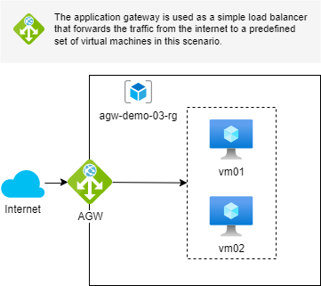

# Azure Application Gateway Demo

A demo project displaying the posibilities of the Azure Applicaton Gateway.
This project contains some deployment scenarios as demonstration on how
an Azure Application Gateway can enhance your web deployment in the
Azure Cloud.

## Disclaimer

The web applications used in this project where taken
from the [eShopOnWeb](https://github.com/dotnet-architecture/eShopOnWeb)
project of the [.NET Application Architecture - Reference Apps Repository](https://github.com/dotnet-architecture).

## Scenario 01

A simple setup.

See [scenario-01](./scenario-01/README.md) for more information.

## Scenario 02

A setup in which the application gateway shows it's WAF capabilities.

See [scenario-02](./scenario-02/README.md) for more information.

## Scenario 03

A load balancing setup with virtual machines.

See [scenario-03](./scenario-03/README.md) for more information.

## Scenario 04

A path based routing setup.

See [scenario-04](./scenario-04/README.md) for more information.

