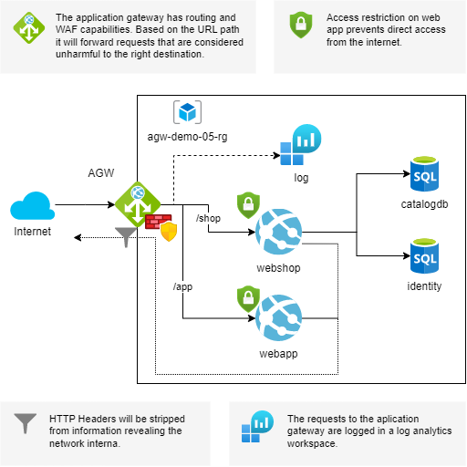

# Scenario 05 - Instructions



## Description

This instruction descripes the steps needed to setup the azure
infrastructure for the current scenario.

## Key Points

The following key points are necessary to consider:

### Aplication Gateway

* For advanced routing features you need the application gateway SKU `Standard_v2` or `WAF_v2`
* Enable the service endpoints `Microsoft.Web` in the subnet of the application gateway
  for accessing the web app, when access restriction is enabled
* For HTTPS capabilities you need to upload a certificate containing the entire certificate chain to the application
  gateway
* For the application gateway to route traffic the backend health status needs to be `Healthy`
* When configuring the backend settings of the application gateway, use the following settings:
  * (DON'T) override backend path: `{empty}`
  * Override with new host name: `Yes`
  * Host name override: `Pick host name from backend target`

### Routed Web App

* To maintain the html links a virtual path needs to be created for each routed web app according to the
  corresponding application gateway route:
  * `shop` in the web shop app for the `/shop` route
  * `app` in the web app for the `/app` route
* For the images of the eShop web application, set the application configuration value `CatalogBaseUrl='/shop/'`.
  With this the images will be loaded with the correct (routed) URL from the database.
* In case of `HTTP Error 500.35` in a web app, verify that the `web.config` of the
  web app configures the `modules` and the `hostingModel` properties as shown in the snippet below:

`web.config` snippet:
```xml
...
  <handlers>
    <add name="aspNetCore" path="*" verb="*" modules="AspNetCoreModuleV2" />
  </handlers>
  <aspNetCore processPath="dotnet" hostingModel="outofprocess" />
...
```

## Prerequirement

The scripts shown require the [azure CLI](https://learn.microsoft.com/en-us/cli/azure/install-azure-cli)
as well as the [Bicep tools](https://learn.microsoft.com/en-us/azure/azure-resource-manager/bicep/install).

Login to your azure portal and set the correct subscription.
In this example the subscription is called `MMA VS Prof. Subscription`. Use
the name of your subscription if you want to use the script.

```powershell
$sub = "MMA VS Prof. Subscription"
az login
az account set -s $sub
```

## Generate certificates

Generate the certificates needed for the TSL/SSL connection and puts them in the `cert` folder.
It is recommended to recreate the certificates for a new setup.

> NOTE: This command requires elevated privileges!

```powershell
..\scripts\generate-cert.ps1 -frontendDnsName agw-demo-05-app.northeurope.cloudapp.azure.com -certOutputRelativePath cert/app
..\scripts\generate-cert.ps1 -frontendDnsName agw-demo-05-shop.northeurope.cloudapp.azure.com -certOutputRelativePath cert/shop
```

## Setup services

```powershell
$rg = "agw-demo-05-rg"
$file = "scenario-05.bicep"
$webshopName = "webshop-agw-demo-05"
$webappName = "app-agw-demo-05"

az group create -n $rg -l northeurope
az deployment group create --name Scenario05 --resource-group $rg --template-file $file --parameters webshopName=$webshopName webappName=$webappName
```

> IMPORTANT: Mind the `/` at the end of the URL!!!

* The url of the AGW (for north europe): https://agw-demo-04.northeurope.cloudapp.azure.com
  * The url of the webshop: https://agw-demo-04.northeurope.cloudapp.azure.com/shop/
  * The url of the webapp: https://agw-demo-04.northeurope.cloudapp.azure.com/app/

## Deploy application

```powershell
az webapp deploy --resource-group $rg --name $webshopName --src-path '../.deployables/eShopOnWeb.zip' --type zip
az webapp deploy --resource-group $rg --name $webappName --src-path '../.deployables/AspNetCoreApp.zip' --type zip
```

## Cleanup

```powershell
az group delete -n $rg
```